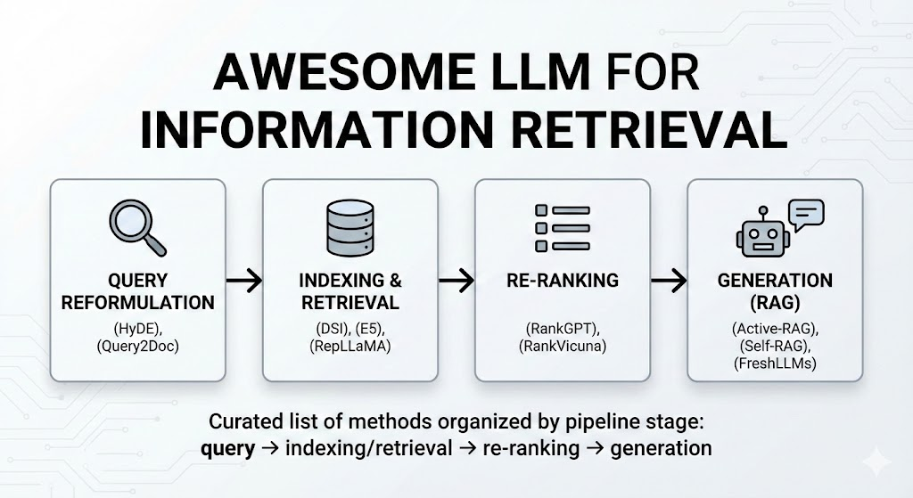

# Awesome LLM-based Information Retrieval

A curated mini-list of LLM-based methods for information retrieval, organized by pipeline stage:  
**query reformulation → indexing & retrieval → re-ranking → generation (RAG).**

This list currently includes the methods used in our comparison table.

---

## Notes

- Papers are grouped by **pipeline stage** and **sorted chronologically** within each group.
- For preprints, we mark the venue as `arXiv` (or workshop) according to the BibTeX entry.
- Model names in parentheses are the commonly used short names in the IR community.

---

## Contents

- [Query Reformulation](#query-reformulation)
- [Indexing & Retrieval](#indexing--retrieval)
- [Re-ranking](#re-ranking)
- [Generation (RAG)](#generation-rag)

---

## Query Reformulation

* (HyDE) Precise Zero-Shot Dense Retrieval without Relevance Labels `arXiv 2022`  
  Zero-shot prompting that lets an LLM hallucinate a hypothetical relevant document, then feeds that synthetic document into a dense retriever.

* (Query2Doc) Query2Doc: Query Expansion with Large Language Models `arXiv 2023`  
  Uses LLMs to expand short queries into pseudo-documents, improving recall for downstream retrievers.

* (LLM-Rewriter) Large Language Models are Strong Zero-shot Retriever `arXiv 2023`  
  Treats an LLM as a conversational query rewriter, producing better-formed search queries and improving retrieval without supervised labels.

---

## Indexing & Retrieval

* (DSI) Transformer Memory as a Differentiable Search Index `NeurIPS 2022`  
  Proposes generative document identifiers and trains a seq2seq model (T5) to directly map queries to doc IDs, removing the explicit index.

* (E5) Text Embeddings by Weakly-supervised Contrastive Pre-training `arXiv 2022`  
  Introduces a family of encoder-only (BERT-style) embedding models pre-trained with weakly supervised contrastive objectives for dense retrieval and related tasks.

* (WebUltron) WebUltron: An Ultimate Retriever on Webpages Under the Model-Centric Paradigm `TKDE 2024`  
  Explores model-centric improvements for webpage retrieval with generative indexing and enhanced document representations.

* (Pairwise-Ranker) Large Language Models are Effective Text Rankers with Pairwise Ranking Prompting  
  `Findings of NAACL 2024`  
  Shows that general-purpose LLMs (e.g., GPT-3.5) can perform strong retrieval/ranking via pairwise comparison prompts, without gradient updates.

* (RepLLaMA) Fine-tuning LLaMA for Multi-Stage Text Retrieval `SIGIR 2024`  
  Fine-tunes LLaMA-2 as both a dense retriever (RepLLaMA) and a pointwise reranker, showing that LLM backbones can be adapted for all stages of an IR pipeline.

---

## Re-ranking

* (RankGPT) Is ChatGPT Good at Search? Investigating Large Language Models as Re-ranking Agents `arXiv 2023`  
  Treats GPT-4-style models as listwise rerankers via prompting, reordering candidate documents returned by a first-stage retriever.

* (RankVicuna) RankVicuna: Zero-shot Listwise Document Reranking with Open-source Large Language Models `arXiv 2023`  
  Uses an open-source Vicuna-7B model for zero-shot listwise reranking, demonstrating competitive performance without proprietary APIs.

* (RankLLaMA) Fine-Tuning LLaMA for Multi-Stage Text Retrieval `SIGIR 2024`  
  The RankLLaMA component fine-tunes LLaMA-2 as a **pointwise reranker**, complementing RepLLaMA dense retrieval in a multi-stage pipeline.

* (RankRAG) RankRAG: Unifying Context Ranking with Retrieval-Augmented Generation in LLMs `NeurIPS 2024`  
  Instruction-tunes a single Llama-3–based model to **both** rank contexts and generate answers, unifying ranking and generation for RAG.

---

## Generation (RAG)

* (Active-RAG) Active Retrieval Augmented Generation `EMNLP 2023`  
  Proposes an *active* RAG loop where the LLM dynamically decides when and how to retrieve, iteratively refining evidence for better answers.

* (Self-RAG) Self-RAG: Self-reflective Retrieval Augmented Generation  
  `NeurIPS 2023 Workshop`  
  Lets an LLM critique its own retrieved evidence and responses, learning to call retrieval and revise answers in a self-reflective manner.

* (FreshLLMs) FreshLLMs: Refreshing Large Language Models with Search Engine Augmentation  
  `ACL 2024 Findings`  
  Integrates web search into LLM generation to combat knowledge staleness, focusing on freshness-aware answer generation.

* (CRAG) Corrective Retrieval Augmented Generation `arXiv 2024`  
  Adds a corrective stage that detects and fixes retrieval or reasoning errors in RAG, aiming to improve reliability of final answers.

---
